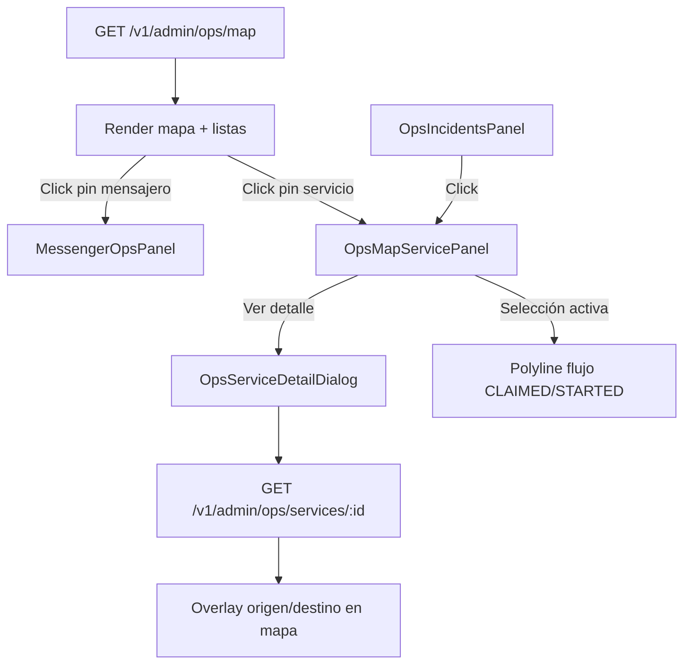

# Centro de Control Operacional — Operación en vivo

Documentación del módulo **Operación en vivo** del panel admin Rutafy.

| | |
|---|---|
| **Ruta** | `/admin/ops/map` |
| **Página** | `client/src/pages/admin/AdminOpsMapPage.tsx` |
| **API** | `GET /v1/admin/ops/map` |
| **Constantes** | `client/src/lib/adminOpsConstants.ts` |
| **Normalización** | `client/src/api/admin-ops-map.ts` |

Relacionado: [frontend/admin-panel.md](./frontend/admin-panel.md), [frontend/realtime-ui.md](./frontend/realtime-ui.md).

---

## Propósito

Supervisar en **tiempo casi real** el estado del dispatch logístico en Buenaventura:

- Dónde están los **mensajeros** (GPS + señal)
- Qué **servicios** están solicitados o en curso
- Si hay **SLA vencido**, servicios detenidos o inconsistencias
- Proximidad **geofence** (recogida / entrega)
- Flujo visual **mensajero → recogida → entrega**

No es trazabilidad histórica (eso es `/admin/tracking`). No es el flujo de campo del transportista/mensajero.

---

## Arquitectura de la pantalla

```
┌─────────────────────────────────────────────────────────────────────────┐
│ Header: título · contadores · toggles capas · Actualizar               │
├─────────────────────────────────────────────────────────────────────────┤
│ MAPA (50vh desktop)                                                     │
│  ├─ Leyenda (top-left)                                                  │
│  ├─ Incidents panel (top-right, lg+)                                    │
│  ├─ Panel lateral servicio/mensajero (overlay top-right)                │
│  └─ Pins mensajero + pins servicio + polyline flujo                     │
├─────────────────────────────────────────────────────────────────────────┤
│ MessengerOpsSummaryBar (disponibles / asignados / en servicio / offline)│
├─────────────────────────────────────────────────────────────────────────┤
│ Contadores por status: REQUESTED · CLAIMED · STARTED · mensajeros       │
├─────────────────────────────────────────────────────────────────────────┤
│ Lista servicios activos (scroll)                                        │
├─────────────────────────────────────────────────────────────────────────┤
│ Lista mensajeros (scroll)                                               │
└─────────────────────────────────────────────────────────────────────────┘
```

**Polling:** cada **30 s** (`POLL_INTERVAL_MS`). Botón **Actualizar** fuerza refresh silencioso.

**Deep link:** `?service_id=<uuid>` abre y enfoca un servicio al cargar (desde alertas dispatch).

---

## Estados operacionales: REQUESTED, CLAIMED, STARTED

Son valores de **`services.status`** — el ciclo operacional real del servicio.

```
REQUESTED  →  CLAIMED  →  STARTED  →  CLOSED
```

| Status | Label UI | Significado operativo | Qué ve el admin |
|--------|----------|----------------------|-----------------|
| **REQUESTED** | Solicitado | Transportista creó el servicio; dispatch busca/ofrece mensajero | Pin **R** amarillo `#eab308`. Sin mensajero asignado típicamente. Capa `requested_services`. |
| **CLAIMED** | Reclamado | Mensajero aceptó; va hacia **recogida** | Pin **C** azul `#3b82f6`. Polyline azul: **mensajero → origen**. Geofence hacia recogida. |
| **STARTED** | En curso | Mensajero recogió; va hacia **entrega** | Pin **S** verde `#22c55e`. Polyline verde: **origen → destino**. Geofence hacia entrega. |
| CLOSED | Cerrado | Servicio finalizado | No visible en mapa V1 (`MAP_VISIBLE_OPERATIONAL_STATUSES` excluye CLOSED) |

### REQUESTED — detalle

- El servicio existe en mercado pero **aún no tiene mensajero en ruta**.
- Puede coexistir con `dispatch_status`: PENDING, SEARCHING, OFFERED, EXHAUSTED…
- En mapa: aparece si toggle **“Mostrar servicios”** está activo.
- SLA de recogida puede empezar a contar según reglas backend.
- Pin con borde rojo si `sla_pickup_breach`.

### CLAIMED — detalle

- Mensajero asignado (`assigned_messenger_id` / `mensajero_id`).
- GPS del mensajero debería moverse hacia el origen.
- **Polyline de flujo:** posición mensajero → coordenadas de **origen** (azul `#2563eb`).
- Geofence posible: `FAR_PICKUP` → `NEAR_PICKUP` → `AT_PICKUP`.
- ETA relevante: `eta_pickup_at`, deadline: `sla_pickup_deadline_at`.

### STARTED — detalle

- Recogida completada (transición backend al iniciar servicio).
- Mensajero en camino al **destino**.
- **Polyline de flujo:** **origen → destino** (verde `#16a34a`). Ya no usa posición GPS del mensajero en la polyline principal.
- Geofence posible: `FAR_DESTINATION` → `NEAR_DESTINATION` → `AT_DESTINATION`.
- ETA relevante: `eta_delivery_at`, deadline: `sla_delivery_deadline_at`.

### status vs dispatch_status

| Campo | Qué es | Badge en UI |
|-------|--------|-------------|
| `status` | Ciclo operacional (REQUESTED…CLOSED) | **OP** — `OperationalStatusBadges` |
| `dispatch_status` | Pipeline de asignación (PENDING, OFFERED…) | **DSP** — mismo componente |

**Regla admin:** leer ambos; el pin de servicio usa **`status`**. El panel lateral muestra OP + DSP juntos.

---

## Capas del snapshot

Endpoint: `GET /v1/admin/ops/map?limit=200`

El backend devuelve capas que el frontend unifica en `mergeAdminOpsMapServices()`:

| Capa backend | Contenido típico | Prioridad merge |
|--------------|------------------|-----------------|
| `messengers[]` | Mensajeros con GPS, ops_state, servicio activo | Pins en mapa |
| `requested_services[]` | Servicios `REQUESTED` | Media |
| `active_services[]` | Servicios `CLAIMED` / `STARTED` | **Alta** (sobreescribe mismo `service_id`) |
| `items[].active_service` | Fallback si capas vacías | Baja |

Resultado normalizado:

- `map_services[]` — lista unificada sin duplicados
- `requested_services[]` — solo REQUESTED
- `active_services[]` — CLAIMED + STARTED

### Toggles de visibilidad (UI)

| Toggle | Efecto |
|--------|--------|
| **Mostrar servicios** | Pins R/C/S en mapa + leyenda servicios |
| **Mostrar fantasma** | Mensajeros sin coords recientes / ghost |
| **Mostrar offline** | Mensajeros `ops_state = OFFLINE` |

Por defecto se ocultan offline y fantasma para reducir ruido.

---

## Capas visuales en el mapa

### 1. Pins de mensajero

Color por `ops_state` (`OPS_MESSENGER_PIN_COLORS`):

| ops_state | Color | Label |
|-----------|-------|-------|
| AVAILABLE | Verde | Disponible |
| ASSIGNED | Azul | Asignado |
| IN_SERVICE | Morado | En servicio |
| BUSY_IDLE | Ámbar | Busy idle |
| OFFLINE | Gris | Offline |

Datos: `lat`/`lng` o `map_lat`/`map_lng`, `location_updated_at`, `is_online`.

Click en pin → **MessengerOpsPanel**.

### 2. Pins de servicio

Solo si **“Mostrar servicios”** activo. Letra en círculo por `status`:

| status | Letra | Color |
|--------|-------|-------|
| REQUESTED | R | Amarillo |
| CLAIMED | C | Azul |
| STARTED | S | Verde |

**Borde rojo** en pin si SLA vencido (`serviceHasSlaBreach`).

Click en pin → **OpsMapServicePanel**.

### 3. Polyline de flujo operacional

Solo con **servicio seleccionado** (no en modal detalle):

| status | Trayecto dibujado | Color |
|--------|-------------------|-------|
| CLAIMED | Mensajero → Origen | Azul |
| STARTED | Origen → Destino | Verde |

Implementación: `syncOperationalFlowOverlay()`. Geodésica, no routing API.

### 4. Overlay detalle servicio

Al abrir **Ver detalle** (`GET /v1/admin/ops/services/:id`):

- Marcadores origen/destino en mapa
- Polyline adicional del detalle
- Leyenda `ServiceRouteLegend` (bottom-left)

---

## SLA

### Campos

Por servicio en snapshot y detalle:

| Campo | Significado |
|-------|-------------|
| `sla_pickup_deadline_at` | Deadline máximo para recogida |
| `sla_delivery_deadline_at` | Deadline máximo para entrega |
| `operational_flags.sla_pickup_breach` | Backend marcó incumplimiento recogida |
| `operational_flags.sla_delivery_breach` | Backend marcó incumplimiento entrega |

Helper: `serviceHasSlaBreach()` → true si cualquier breach flag es true.

### Cómo se muestra

| Ubicación | Representación |
|-----------|----------------|
| Pin servicio en mapa | Borde/anillo rojo |
| Tooltip / título pin | Línea `SLA vencido · recogida / entrega` |
| Panel lateral servicio | Banner rojo + campos SLA/ETA |
| OpsIncidentsPanel | Incidente `sla_breach` → click abre servicio |
| Dialog detalle | Flags `sla_pickup_breach`, `sla_delivery_breach` |

**SLA ≠ ETA:** SLA es deadline contractual; ETA es estimación de llegada (ver siguiente sección).

---

## ETA

### Campos

| Campo | Uso típico |
|-------|------------|
| `eta_pickup_at` | Estimación llegada a recogida (ISO timestamp) |
| `eta_delivery_at` | Estimación llegada a entrega |
| `estimated_route_duration_minutes` | Duración estática ruta (solo en detalle SLA) |
| `estimated_route_distance_km` | Distancia estática ruta (detalle) |

### Cómo se muestra en ops map

- **Panel lateral servicio:** `DetailField` “ETA recogida” / “ETA entrega” con `formatDateTime` (fecha/hora absoluta).
- **Dialog detalle:** bloque SLA con ETA + deadlines + duración/distancia estimada.

### Qué NO hace el admin ops map

- **No** muestra countdown dinámico (`Date.now()` restado del ETA).
- **No** recalcula ETA con GPS en frontend.
- Los timestamps son **referencia operativa** fijados en dispatch, no un reloj en vivo.

En campo (transportista/mensajero), el hero usa ETA **estático** por minutos de ruta — ver [frontend/maps-and-tracking.md](./frontend/maps-and-tracking.md).

---

## Geofence

Estado calculado **en backend** a partir del GPS del mensajero y coords origen/destino. El admin **solo consume** `geofence_state`.

### Valores posibles

| geofence_state | Label UI |
|----------------|----------|
| `FAR_PICKUP` | Lejos · recogida |
| `NEAR_PICKUP` | Cerca · recogida |
| `AT_PICKUP` | En recogida |
| `FAR_DESTINATION` | Lejos · destino |
| `NEAR_DESTINATION` | Cerca · destino |
| `AT_DESTINATION` | En destino |

Componente: `GeofenceBadge` — prefijo **GF** + color por estado.

### Relación con status

| status | Geofence esperado |
|--------|-------------------|
| CLAIMED | Estados `*_PICKUP` |
| STARTED | Estados `*_DESTINATION` |

En apps de campo, WebSocket emite `geofence.updated` con subset `AT_PICKUP` / `AT_DROPOFF` para overlay UI — el admin map recibe el estado completo vía REST polling.

### Dónde aparece

- Panel lateral servicio (`OpsMapServicePanel`)
- Dialog detalle (`OpsServiceDetailDialog`)
- Snapshot listado servicios (si backend incluye campo)

---

## Panel lateral (overlay en mapa)

Dos paneles flotantes mutuamente excluyentes con selección:

### MessengerOpsPanel

Se abre al seleccionar un **mensajero** (pin o fila lista).

| Sección | Contenido |
|---------|-----------|
| Header | Nombre, teléfono, badge `ops_state` |
| Señal | En línea / Señal vencida / Sin dato |
| Última ubicación | Coords + `location_updated_at` |
| Placa | `plate` |
| Servicio activo | ID truncado + status |
| Acciones | **Recentrar**, **Abrir servicio** (si tiene activo) |

### OpsMapServicePanel

Se abre al seleccionar un **servicio** (pin o fila lista).

| Sección | Contenido |
|---------|-----------|
| Header | `service_short`, ID, badges OP + DSP + GF |
| Extras operativos | Transportista, mensajero, tipo, stuck level, edad |
| ETA / SLA | Timestamps recogida y entrega |
| Alertas | Banner SLA breach, badges detenido/inconsistencia |
| Ruta | Origen / destino (`OperationalLocationDisplay`) |
| Acciones | **Recentrar en mapa**, **Ver detalle** (modal) |

### Posicionamiento responsive

| Viewport | Panel |
|----------|-------|
| Desktop (md+) | Flotante top-right sobre mapa, `w-80` |
| Desktop (lg+) | Incidents a la derecha; panel servicio desplazado (`lg:right-[19rem]`) |
| Móvil | Bottom sheet fijo (`max-h-[40vh]`) |

Cerrar panel: botón X → deselecciona entidad.

---

## Panel de incidentes

`OpsIncidentsPanel` — deriva alertas de flags sin request extra:

| kind | Origen |
|------|--------|
| `sla_breach` | `sla_pickup_breach` o `sla_delivery_breach` |
| `service_stopped` | `service_stopped` o `stuck_level` ALERT/WARN |
| `heartbeat_stale` | flag servicio o mensajero offline + GPS stale |
| `offline_with_active` | Mensajero OFFLINE con `active_service` |
| `operational_inconsistency` | flag inconsistencia |

Click en incidente → selecciona servicio y abre detalle.

---

## Dialog detalle servicio

`OpsServiceDetailDialog` — carga `GET /v1/admin/ops/services/:id`.

| Bloque | Campos |
|--------|--------|
| Badges | OP, DSP, Geofence |
| Ruta | Origen, destino |
| Actores | Transportista, mensajero (teléfonos) |
| SLA | ETA recogida/entrega, deadlines, duración/distancia |
| Flags | stuck, edad, idle, alertas, breaches |
| Timeline | Historial `from_status → to_status` |

Al abrir, sincroniza overlay visual adicional en el mapa principal.

---

## API y archivos clave

```
client/src/
├── pages/admin/AdminOpsMapPage.tsx      # Orquestador principal
├── api/
│   ├── admin-ops-map.ts                 # Snapshot + merge capas
│   └── admin-ops-service.ts             # Detalle servicio
├── lib/adminOpsConstants.ts           # Status, colores, geofence
└── components/admin/
    ├── GeofenceBadge.tsx
    ├── OperationalStatusBadges.tsx
    ├── OpsIncidentsPanel.tsx
    └── MessengerOpsSummaryBar.tsx
```

---

## Diagrama de flujo de selección



---

## Reglas para no romper ops map

1. Pins y polylines usan **`status`**, no solo `dispatch_status`.
2. No mezclar semántica de **trazabilidad** (captura Android) con flujo dispatch.
3. SLA breach debe ser visible sin abrir detalle (borde pin + incidents).
4. Polling 30 s es fuente de verdad; no depender de WebSocket en admin hoy.
5. Preferir `google.maps.Marker` con fallback si AdvancedMarker falla.
6. REQUESTED / CLAIMED / STARTED son los únicos visibles en mapa V1.

---

## Evolución futura (no implementado)

Anotado en `adminOpsConstants.ts`:

- Congestión portuaria
- Eventos geofence en timeline
- Permanencia en terminales
- ETA operacional dinámico en mapa admin
- Validación puerto declarado vs real
- Mapa de calor operacional
