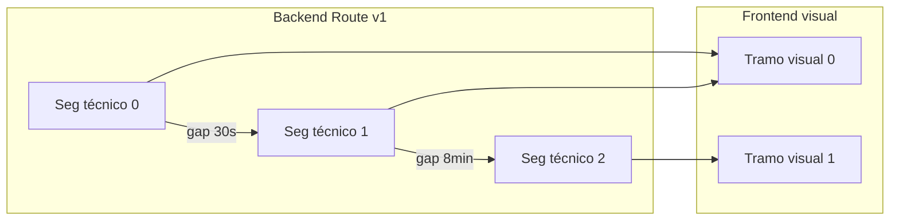

# Trazabilidad GPS — Panel admin

Documentación del módulo **Trazabilidad** del panel admin Rutafy: sesiones de captura GPS desde Android, calidad de la señal y recorrido histórico.

| | |
|---|---|
| **Listado** | `/admin/tracking` |
| **Vista completa** | `/admin/tracking/:sessionId` |
| **Páginas** | `AdminTrackingSessionsPage.tsx`, `AdminTrackingSessionRoutePage.tsx` |
| **API** | `client/src/api/tracking-sessions.ts` |
| **Constantes / formatters** | `trackingSessionConstants.ts`, `trackingSessionFormatters.ts` |
| **Segmentos visuales** | `trackingRouteVisualSegments.ts` |

Relacionado: [admin-ops.md](./admin-ops.md) (operación en vivo / dispatch), [frontend/maps-and-tracking.md](./frontend/maps-and-tracking.md) (tracking en campo).

---

## Propósito

Auditar **sesiones de captura GPS** registradas por la app Android:

- ¿Cuánto tiempo estuvo activa la sesión?
- ¿Qué tan continua fue la captura?
- ¿Cuál fue el recorrido observado en el mapa?
- ¿Hay huecos que invalidan la distancia reportada?

No es el mapa operativo de dispatch (`/admin/ops/map`). No reemplaza el tracking en tiempo real del transportista/mensajero.

---

## Dos niveles de consulta

| Vista | Ruta | API | Contenido |
|-------|------|-----|-----------|
| **Listado** | `/admin/tracking` | `GET /v1/admin/tracking-sessions` | Tabla de sesiones; columna Calidad; acciones rápidas |
| **Resumen (dialog)** | Modal desde listado | `GET /v1/admin/tracking-sessions/:id` | Hero calidad + KPIs + timeline de sesión (sin mapa) |
| **Vista completa** | `/admin/tracking/:sessionId` | Detalle + `GET …/:id/route` en paralelo | Hero + KPI strip + **mapa** + panel lateral con timeline técnico |

```
Listado ──Ver resumen──► Dialog (stats + timeline sesión)
       └──Vista completa──► Página route (mapa + route + timeline técnico)
```

**Regla:** el listado no hace N+1; `capture_quality` viene en el item raíz o en `stats` (normalizado en `normalizeSession()`).

---

## Sesiones

### Qué es una sesión

Registro de una ventana de captura GPS en Android asociada a:

| Campo | Significado |
|-------|-------------|
| `session_id` / `id` | UUID de la sesión (el frontend normaliza ambos) |
| `owner_user_id` | Usuario dueño de la captura |
| `actor_id` / `actor_type` | Quién capturó (`messenger`, `transporter`, `admin`) |
| `vehicle_id` / `vehicle_label` | Unidad / placa mostrada en UI |
| `purpose` | Contexto: `terminal`, `patio`, `puerto`, `operacion_interna` |
| `status` | `active`, `ended`, `abandoned` |
| `started_at` / `ended_at` | Ventana temporal de la sesión |
| `last_heartbeat_at` | Última señal de vida desde el dispositivo |
| `consent_at` | Momento de consentimiento (si aplica) |
| `point_count` / `duration_seconds` | Resumen rápido en listado |
| `capture_quality` | Tier de calidad (ver sección Quality) |

### Estados de sesión

| status | Label UI | Significado |
|--------|----------|-------------|
| `active` | Activa | Captura en curso |
| `ended` | Finalizada | Sesión cerrada normalmente |
| `abandoned` | Cancelada | Sesión cancelada o interrumpida |

### Listado (`AdminTrackingSessionsPage`)

Columnas: vehículo, actor, propósito, estado, inicio, duración, puntos, **calidad**, último heartbeat, acciones.

Acciones por fila:

- **Detalle** → dialog con métricas, puntos recientes y cierre de sesión activa
- **Ruta** → navega a `/admin/tracking/:sessionId`

Si `status=active`, el detalle y la vista de ruta muestran **Finalizar** y **Cancelar** (con confirmación).

Recarga manual con botón **Recargar** (sin polling automático).

### Detalle de sesión

`getAdminTrackingSessionDetail(id)` devuelve:

```typescript
{
  session: AdminTrackingSession;
  stats: AdminTrackingSessionStats;
  trace_id?: string;
}
```

En la vista completa, `mergeHeroStats()` combina `detail.stats` con `route.quality` y `route.route_meta` cuando la ruta está disponible (prioridad route para cobertura/calidad/puntos).

---

## Mapas

### Endpoint de ruta

`GET /v1/admin/tracking-sessions/:sessionId/route`

Respuesta normalizada (`AdminTrackingSessionRoute`):

| Bloque | Contenido |
|--------|-----------|
| `route_meta` | Metadatos: puntos totales/devueltos/excluidos, `gap_split_seconds`, truncado, filtros de accuracy |
| `quality` | Cobertura, calidad, gaps (duplica métricas clave del detalle) |
| `summary` | `distance_m`, `distance_km` — distancia observada |
| `bounds` | Bounding box para encuadre |
| `start_point` / `end_point` | Primer y último punto GPS |
| `segments[]` | Tramos **técnicos** con puntos, distancia y `gap_before_seconds` |
| `overlays[]` | Reservado para capas futuras (PR, peajes, nodos) |

### Componente `TrackingRouteMap`

Layout: **70%** del grid en desktop (`xl:grid-cols-[7fr_3fr]`).

| Elemento | Implementación |
|----------|----------------|
| Polyline verde | Un tramo por **segmento visual** (ver Visual segments) |
| Pin **I** (verde) | `start_point` — inicio GPS |
| Pin **F** (azul marino) | `end_point` — fin GPS |
| Encuadre | `bounds` del backend, o fit a todos los puntos |
| **Recentrar** | Botón top-right |
| Leyenda | Bottom-left: línea continua, gaps > 5 min, pins I/F |

Cuando `route_meta.truncated === true`, la página muestra badge **“Ruta simplificada / truncada”** con `truncation_reason` si viene.

Estados vacíos:

- Sin route cargada → “Cargando recorrido…”
- Sin coordenadas → “No hay coordenadas para esta sesión”
- Error Google Maps → “No se pudo cargar el mapa”

### Segmentos técnicos vs visuales en el mapa

- **Backend** parte la ruta en `segments[]` cuando hay un gap ≥ `gap_split_seconds` (default **60 s** en `route_meta`).
- **Frontend** agrupa esos tramos en **segmentos visuales** antes de pintar (umbral **300 s / 5 min**).
- Un gap mayor a 5 min genera **polylines separadas** en el mapa (discontinuidad visible entre tramos verdes).

---

## Timeline

Hay dos timelines con distinto nivel de detalle.

### Timeline de sesión (dialog resumen)

En `TrackingSessionDetailDialog`. Eventos de la **sesión**, no del recorrido:

1. Inicio de captura (`started_at`)
2. Consentimiento (`consent_at`) — si existe
3. Último heartbeat (`last_heartbeat_at`)
4. Cierre (`ended_at`) — si existe

No incluye tramos GPS ni gaps.

### Timeline técnico (vista completa)

En `TrackingRouteSidePanel` → `TrackingRouteTimeline`. Orden cronológico:

1. **Inicio sesión** — `session.started_at`
2. **Primer punto GPS** — `start_point` o primer punto del primer segmento
3. Por cada **segmento técnico**:
   - Si `gap_before_seconds > 0`:
     - Gap **≥ 5 min** → “Interrupción GPS relevante” (punto ámbar)
     - Gap **< 5 min** → “Gap menor (continuidad probable)” (punto gris)
   - **Tramo técnico N** — puntos, distancia km, rango horario
4. **Último punto GPS** — `end_point` o último punto del último segmento
5. **Cierre sesión** — `session.ended_at` si existe

El timeline técnico refleja la estructura de `route.segments[]` del backend; los gaps visuales del mapa usan el umbral de 5 min del frontend.

---

## KPIs

### KPI strip (vista completa)

`TrackingRouteKpiStrip` — grid de 9 tarjetas:

| KPI | Fuente | Descripción |
|-----|--------|-------------|
| Duración sesión | `stats.duration_seconds` | Tiempo total de la sesión |
| Cobertura GPS | `route.quality.coverage_pct` → fallback `stats` | Porcentaje de cobertura |
| Tiempo cubierto | `route.quality.covered_seconds` → fallback `stats` | Segundos con captura efectiva |
| Puntos GPS | `route_meta.point_count` → fallback `stats.point_count` | Total de puntos en la ruta |
| **Distancia observada** | `route.summary.distance_km` | Suma GPS (con tooltip explicativo) |
| Tramos visuales | `countVisualSegments(route)` | Polylines que se dibujan en mapa |
| Tramos GPS | `route_meta.segment_count` | Segmentos técnicos del backend |
| Gap máximo | `quality.max_gap_seconds` → fallback `stats` | Mayor hueco entre puntos |
| Precisión promedio | `stats.avg_accuracy_m` | Accuracy media en metros |

### Stats grid (dialog resumen)

`TrackingSessionStatsGrid` — 9 métricas del detalle sin route:

Duración, cobertura, tiempo cubierto, puntos, precisión promedio, velocidad promedio, % accuracy >50 m, gaps >60 s, gap máximo.

### Hero y alertas de calidad

`TrackingCaptureQualityHero` + `TrackingCaptureQualityAlert`:

- Hero con tier, cobertura y tiempo cubierto
- Alerta contextual según tier (mensajes en `captureQualityAlertMessage`)

`TrackingObservedDistanceAlert` (solo vista completa): si cobertura **< 70%**, avisa que la distancia observada puede ser inferior a la real.

---

## Coverage (cobertura)

Mide **qué proporción del tiempo de sesión tuvo captura GPS continua**, no qué proporción del territorio se recorrió.

### Campos

| Campo | Tipo | Significado |
|-------|------|-------------|
| `coverage_pct` | number (0–100) | Porcentaje del tiempo de sesión cubierto por GPS |
| `covered_seconds` | number | Segundos efectivamente cubiertos |

Calculados en **backend** a partir de gaps entre puntos y duración de sesión. El frontend solo muestra y formatea (`formatCoveragePct` — un decimal: `6.2%`).

### Dónde aparece

- Hero calidad (cobertura + tiempo cubierto)
- KPI strip / stats grid
- Columna indirecta: sesiones con baja cobertura disparan `TrackingObservedDistanceAlert`

### Interpretación

| Cobertura | Lectura operativa |
|-----------|-------------------|
| Alta (~90%+) | Recorrido bien representado temporalmente |
| Media (70–90%) | Huecos moderados; revisar timeline |
| Baja (<70%) | Distancia observada probablemente subestimada; alerta automática |

**Coverage ≠ distancia recorrida.** Una sesión puede tener 100% de cobertura temporal pero pocos puntos si el vehículo estuvo detenido.

---

## Quality (calidad de captura)

Tier agregado **`capture_quality`** asignado por el backend según continuidad, gaps y métricas de captura.

### Tiers reconocidos

| Tier | Label UI | Emoji | Color hero |
|------|----------|-------|------------|
| `excellent` | Excelente | 🟢 | Verde |
| `good` | Buena | 🟡 | Ámbar |
| `partial` | Parcial | 🟠 | Naranja |
| `incomplete` | Incompleta | 🔴 | Rojo |

Normalización: `normalizeCaptureQuality()` en `trackingSessionConstants.ts`. Valores desconocidos se muestran como texto crudo.

### Mensajes de interpretación

| Tier | Mensaje |
|------|---------|
| incomplete | Huecos prolongados; puede no representar todo el recorrido |
| partial | Captura parcial; secciones pueden faltar |
| good | Buena continuidad; representa la mayor parte del recorrido |
| excellent | Excelente continuidad; prácticamente todo el recorrido |

### Fuentes en UI

| Vista | Fuente de `capture_quality` |
|-------|----------------------------|
| Listado | Raíz del item o `stats.capture_quality` (`pickCaptureQualityFromSession`) |
| Dialog | `detail.stats.capture_quality` |
| Vista completa | `mergeHeroStats`: prioridad `route.quality.capture_quality` |

### Métricas relacionadas (no son el tier, pero influyen)

- `gap_count_over_60s` — cantidad de huecos > 60 s
- `max_gap_seconds` — mayor hueco
- `pct_accuracy_over_50m` — % puntos con accuracy > 50 m
- `avg_accuracy_m`, `avg_speed_mps`

El tier es un **resumen ejecutivo**; los KPIs de gaps y accuracy permiten auditar el diagnóstico.

---

## Observed distance (distancia observada)

Distancia calculada **solo a partir de puntos GPS capturados**, sumando los tramos entre coordenidas consecutivas dentro de cada segmento técnico.

### Campos

| Campo | Ubicación |
|-------|-----------|
| `summary.distance_km` | Respuesta `/route` (UI principal) |
| `summary.distance_m` | Misma respuesta en metros |
| `segments[].distance_km` | Por tramo técnico (timeline) |

### Qué representa

- Kilómetros **efectivamente trazados** por la polyline GPS.
- Incluye solo tramos donde hubo puntos; **no infiere** el camino en los huecos.

### Qué NO representa

- Distancia de ruteo Google Maps / OSRM.
- Distancia contractual del servicio de transporte.
- Distancia “real” del vehículo si hubo apagón GPS prolongado.

Tooltip en KPI strip (`OBSERVED_DISTANCE_HELP`):

> Corresponde únicamente a los kilómetros capturados por GPS. No representa necesariamente la distancia total del recorrido.

### Alerta por baja cobertura

Si `coverage_pct < 70%`, `TrackingObservedDistanceAlert` advierte que la distancia observada puede ser **inferior a la distancia real** por interrupciones de captura.

---

## Visual segments (tramos visuales)

Capa de **presentación frontend** que simplifica los segmentos técnicos del backend para el mapa y el KPI “Tramos visuales”.

### Problema que resuelve

El backend parte la ruta en tramos técnicos cada **60 s** de gap (`gap_split_seconds`). Eso puede generar muchos segmentos pequeños por micro-cortes (túnel, pantalla apagada breve). Pintar cada uno por separado fragmenta visualmente el mapa.

### Regla de agrupación

Implementación: `buildVisualSegments()` en `trackingRouteVisualSegments.ts`.

```
VISUAL_GAP_THRESHOLD_SECONDS = 300  (5 minutos)
```

| Condición | Comportamiento |
|-----------|----------------|
| `gap_before_seconds < 300` | Consolidar segmentos técnicos consecutivos en **un tramo visual** |
| `gap_before_seconds ≥ 300` | Iniciar **nuevo tramo visual** → polyline separada en mapa |

Función auxiliar: `isMajorVisualGap(gap)`.

### Estructura `VisualSegment`

```typescript
{
  visualIndex: number;
  sourceSegments: number[];   // índices técnicos agrupados, ej. [0, 1, 2]
  points: TrackingRoutePoint[];
  started_at / ended_at;
  point_count;
}
```

### Mapa vs timeline

| Capa | Granularidad |
|------|--------------|
| **Mapa** | Un polyline verde por segmento **visual** |
| **Timeline** | Lista cada segmento **técnico** + gaps antes de cada uno |
| **KPI “Tramos visuales”** | `countVisualSegments(route)` |
| **KPI “Tramos GPS”** | `route_meta.segment_count` (técnicos) |

Ejemplo: 4 segmentos técnicos con gaps de 30 s, 45 s y 8 min → **2 tramos visuales** (los dos primeros consolidados; el tercero separado por gap de 8 min).

### Diagrama



---

## Arquitectura de archivos

```
client/src/
├── pages/admin/
│   ├── AdminTrackingSessionsPage.tsx       # Listado
│   └── AdminTrackingSessionRoutePage.tsx   # Vista completa
├── api/tracking-sessions.ts                # Tipos + normalización + fetch
├── lib/
│   ├── trackingSessionConstants.ts         # Labels, tiers calidad
│   ├── trackingSessionFormatters.ts        # Fechas, %, distancia
│   └── trackingRouteVisualSegments.ts      # buildVisualSegments
└── components/admin/
    ├── TrackingSessionDetailDialog.tsx
    ├── TrackingSessionCloseActions.tsx
    ├── TrackingSessionStatsGrid.tsx
    ├── TrackingCaptureQualityBanner.tsx
    └── tracking-route/
        ├── TrackingRouteHeader.tsx
        ├── TrackingRouteKpiStrip.tsx
        ├── TrackingRouteMap.tsx
        ├── TrackingRouteSidePanel.tsx
        ├── TrackingRouteTimeline.tsx
        └── TrackingObservedDistanceAlert.tsx
```

---

## API resumida

| Método | Ruta | Uso |
|--------|------|-----|
| GET | `/v1/admin/tracking-sessions?limit=50&status=` | Listado |
| GET | `/v1/admin/tracking-sessions/:id` | Detalle + stats |
| GET | `/v1/admin/tracking-sessions/:id/route` | Puntos, segmentos, distancia, calidad |
| GET | `/v1/admin/tracking-sessions/:id/points?limit=` | Puntos GPS recientes (preview en detalle) |
| POST | `/v1/admin/tracking-sessions/:id/end` | Finalizar sesión activa → `ended` |
| POST | `/v1/admin/tracking-sessions/:id/cancel` | Cancelar sesión activa → `abandoned` |

Respuesta de cierre:

```json
{
  "ok": true,
  "session": {
    "session_id": "…",
    "status": "ended",
    "ended_at": "…"
  }
}
```

Auth: `adminHttp` con `VITE_RUTAFY_ADMIN_KEY`.

---

## Separación ops map vs trazabilidad

| Dimensión | Operación en vivo | Trazabilidad |
|-----------|-------------------|--------------|
| Ruta | `/admin/ops/map` | `/admin/tracking` |
| Fuente | Snapshot dispatch + GPS mensajero | Sesiones Android + route histórica |
| Tiempo | Polling 30 s, casi tiempo real | Histórico, carga bajo demanda |
| Objetivo | Supervisar servicios activos | Auditar calidad y recorrido capturado |
| Distancia | No aplica (flujo operacional) | **Distancia observada** GPS |
| Estados | REQUESTED / CLAIMED / STARTED | active / ended / abandoned |

---

## Reglas para no romper trazabilidad

1. Listado: **una request**; no pedir detalle/route por fila.
2. `capture_quality` en listado: fallback a `stats` en normalización.
3. Vista completa: cargar detalle y route **en paralelo** (`Promise.all`).
4. Mapa: usar `buildVisualSegments()`; no mutar `route.segments` del backend.
5. Distancia observada: siempre con disclaimer; alerta si cobertura < 70%.
6. No confundir **tramos GPS** (backend, 60 s) con **tramos visuales** (frontend, 5 min).

---

## Evolución futura

- Mapa en dialog resumen (hoy solo en vista completa)
- Overlays en `route.overlays` (PR, peajes, nodos portuarios)
- Polylines punteadas explícitas entre tramos visuales en huecos > 5 min
- Filtros de accuracy aplicables desde UI (`route_meta.filters_applied`)
