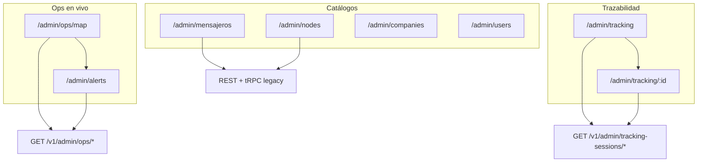

# Panel administrativo — Rutafy Web

Documentación de arquitectura frontend del **panel admin** (`/admin/*`). Complementa [frontend-architecture.md](./frontend-architecture.md), [admin-ops.md](../admin-ops.md) (operación en vivo), [admin-tracking.md](../admin-tracking.md) (trazabilidad GPS) y la interfaz operativa de campo en [operational-interface.md](./operational-interface.md).

---

## Propósito del panel

El admin **no es el flujo principal de campo**. Es la capa de **supervisión, configuración y análisis** para operaciones Rutafy:

| Dominio | Qué hace el admin |
|---------|-------------------|
| **Ops en vivo** | Mapa de mensajeros y servicios activos (dispatch) |
| **Trazabilidad** | Análisis histórico de captura GPS (Android) |
| **Alertas** | SLA breach, redispatch |
| **Catálogos** | Mensajeros, nodos, transportistas, usuarios |
| **Servicios** | Listado legacy / gestión (tRPC) |

**Principio:** no mezclar semántica de **captura logística** (trazabilidad) con **dispatch operativo en vivo** (ops map). Son productos visuales distintos aunque compartan Google Maps.

---

## Stack y arranque

| Capa | Tecnología |
|------|------------|
| UI | React 18 + TypeScript |
| Build | Vite (`npm run web:dev`, puerto 5173) |
| Routing | wouter |
| Estilos | Tailwind + shadcn/ui |
| Mapas | Google Maps vía `MapView` |
| Toasts | sonner |

Variables de entorno relevantes:

| Variable | Uso |
|----------|-----|
| `VITE_RUTAFY_API_BASE` | Base URL API Rutafy |
| `VITE_RUTAFY_ADMIN_KEY` | Fallback `x-admin-key` si no hay JWT |
| `VITE_ADMIN_DEV_BYPASS` | Bypass auth en desarrollo (`true`) |
| `VITE_GOOGLE_MAPS_API_KEY` | Script Google Maps (MapView) |

---

## Autenticación admin (sesión separada)

El admin usa **auth independiente** del transportista/mensajero.

```
/admin/login  →  POST /v1/admin/auth/login
              →  tokens en authAdminStorage
/admin/*      →  AdminProtectedRoute → AdminLayout
```

| Módulo | Archivo |
|--------|---------|
| Login | `pages/admin/AdminLogin.tsx` |
| HTTP + refresh | `api/adminHttp.ts` |
| Auth helpers | `api/adminAuth.ts` |
| Storage | `authAdminStorage.ts` |
| Hook sesión | `hooks/useAdminAuth.ts` |
| Guard rutas | `components/AdminProtectedRoute.tsx` |
| Shell UI | `components/AdminLayout.tsx` |

Comportamiento del guard:

- `/admin` redirige a **`/admin/ops/map`** (centro de control).
- Sin credenciales → `/admin/login`.
- Refresh automático en 401 vía `adminHttp` interceptors.
- Dev bypass: `VITE_ADMIN_DEV_BYPASS=true` permite entrar sin token.

---

## Registro de rutas

Definidas en `routes/AdminRoutes.tsx`, montadas desde `App.tsx`:

| Ruta | Página | Propósito |
|------|--------|-----------|
| `/admin/login` | `AdminLogin` | Login (sin guard) |
| `/admin` | redirect → ops map | — |
| `/admin/ops/map` | `AdminOpsMapPage` | **Operación en vivo** |
| `/admin/tracking` | `AdminTrackingSessionsPage` | Listado trazabilidad |
| `/admin/tracking/:sessionId` | `AdminTrackingSessionRoutePage` | **Resumen operacional + mapa** |
| `/admin/alerts` | `AdminDispatchAlerts` | Alertas dispatch |
| `/admin/mensajeros` | `AdminMensajerosPage` | CRUD mensajeros |
| `/admin/services` | `AdminServicesPage` | Servicios (tRPC legacy) |
| `/admin/nodes` | `AdminNodes` | Nodos logísticos |
| `/admin/companies` | `AdminCompanies` | Transportistas |
| `/admin/users` | `AdminUsers` | Usuarios |

Sidebar (`AdminLayout.tsx`, orden actual):

1. Operación en vivo
2. Trazabilidad
3. Alertas
4. Mensajeros
5. Servicios
6. Nodos logísticos
7. Transportistas
8. Usuarios

---

## Dos capas de datos en admin

El panel mezcla **dos clientes HTTP** por razones históricas:

### A — REST Rutafy API (`adminHttp`)

Usado por vistas operativas modernas conectadas al backend Fastify en producción.

| Módulo API | Consumidor |
|------------|------------|
| `api/admin-ops-map.ts` | `AdminOpsMapPage` |
| `api/admin-ops-service.ts` | Detalle servicio en ops map |
| `api/admin.ts` | `AdminDispatchAlerts` (redispatch) |
| `api/admin-messengers.ts` | `AdminMensajerosPage` |
| `api/tracking-sessions.ts` | Trazabilidad |
| `api/adminHttp.ts` + páginas | `AdminNodes` (CRUD nodos) |

Patrón: tipos exportados, normalizadores defensivos snake/camel, `parseAdminApiError`.

### B — tRPC legacy (`lib/trpc`)

Usado por CRUD clásico contra el servidor Node embebido del monorepo.

| Página | Procedures |
|--------|------------|
| `AdminDashboard` | companies, users, services list |
| `AdminCompanies` | CRUD companies |
| `AdminUsers` | CRUD users |
| `AdminServicesPage` | list, events, updateStatus, delete |

**Regla para nuevas features admin:** preferir **REST + `adminHttp`** alineado con API de producción. No extender tRPC salvo mantenimiento legacy.

---

## Dominio 1 — Operación en vivo (`/admin/ops/map`)

### Propósito

Supervisar **mensajeros y servicios en tiempo casi real**: posición GPS, estados operacionales, SLA, geofence.

### Datos

| Request | Intervalo | Rol |
|---------|-----------|-----|
| `GET /v1/admin/ops/map?limit=N` | 30 s polling | Snapshot mensajeros + servicios |

Normalización en `api/admin-ops-map.ts`:

- `messengers[]`: lat/lng, `location_updated_at`, `ops_state`, servicio activo
- Capas: `requested_services`, `active_services` → merge sin duplicados

Detalle servicio (modal):

- `GET /v1/admin/ops/services/:id`

### Componentes clave

| Componente | Rol |
|------------|-----|
| `AdminOpsMapPage.tsx` | Orquestador (~2300 líneas): mapa, paneles, polling |
| `MapView` | Wrapper Google Maps |
| `OpsIncidentsPanel` | Heartbeat stale, inconsistencias |
| `MessengerOpsSummaryBar` | Resumen mensajero seleccionado |
| `OperationalStatusBadges` | OP + DSP badges |
| `GeofenceBadge` | `AT_PICKUP` / `AT_DROPOFF` |
| `OperationalLocationDisplay` | Texto origen/destino |

### Mapa ops — semántica visual

Constantes en `lib/adminOpsConstants.ts`:

| Elemento | Significado |
|----------|-------------|
| Pin mensajero | Color por `ops_state` (AVAILABLE, ASSIGNED, IN_SERVICE…) |
| Pin servicio | Letra por `status` (R=REQUESTED, C=CLAIMED, S=STARTED) |
| Polyline flujo | Origen → destino del servicio seleccionado (gris/morado) |

**No confundir** con polyline de trazabilidad (captura GPS histórica).

### Deep link

`?service_id=` en URL abre/enfoca servicio (usado desde alertas).

---

## Dominio 2 — Trazabilidad (`/admin/tracking`)

### Propósito

Análisis **read-only** de sesiones de captura GPS desde Android. Dominio **histórico/analítico**, no dispatch.

### Flujo de navegación

```
/admin/tracking                    → listado (1 request)
/admin/tracking/:sessionId         → vista completa (2 requests paralelos)
Dialog "Ver resumen"               → preview rápido (1 request detalle)
```

### API

| Endpoint | Uso |
|----------|-----|
| `GET /v1/admin/tracking-sessions?limit=50` | Listado |
| `GET /v1/admin/tracking-sessions/:id` | Detalle + stats |
| `GET /v1/admin/tracking-sessions/:id/route` | Puntos, segmentos, bounds, calidad |

Módulo: `api/tracking-sessions.ts`

**Anti-patrón:** N+1 en listado. El listado **no** llama detalle/route por fila.

### Listado (`AdminTrackingSessionsPage`)

Columnas: unidad, actor, propósito, estado, inicio, duración, puntos, **calidad** (si viene en session), último heartbeat.

Acciones por fila:

- **Ver resumen** → Dialog (`TrackingSessionDetailDialog`)
- **Vista completa** → navega a `/admin/tracking/:id`

### Vista completa (`AdminTrackingSessionRoutePage`)

Layout desktop (grid `xl:grid-cols-[7fr_3fr]`):

```
Header (volver, vehículo, badges)
  ↓
Hero calidad + alertas interpretación
  ↓
KPI strip compacto
  ↓
[ Mapa 70% | Panel lateral 30% ]
```

| Componente | Archivo |
|------------|---------|
| Header | `tracking-route/TrackingRouteHeader.tsx` |
| Hero calidad | `TrackingCaptureQualityBanner.tsx` |
| KPI strip | `tracking-route/TrackingRouteKpiStrip.tsx` |
| Mapa ruta | `tracking-route/TrackingRouteMap.tsx` |
| Panel lateral | `tracking-route/TrackingRouteSidePanel.tsx` |
| Timeline | `tracking-route/TrackingRouteTimeline.tsx` |
| Alerta distancia | `tracking-route/TrackingObservedDistanceAlert.tsx` |

Utilidades:

- `lib/trackingSessionConstants.ts` — labels calidad, badges
- `lib/trackingSessionFormatters.ts` — duración, cobertura, fechas
- `lib/trackingRouteVisualSegments.ts` — consolidación visual de gaps (<5 min vs ≥5 min)

### Mapa de trazabilidad — semántica visual

| Elemento | Estilo | Significado |
|----------|--------|-------------|
| Polyline cubierta | Verde `#16a34a`, sólida | GPS capturado |
| Gap visual mayor | Punteado / separación | Hueco ≥ 300 s (`VISUAL_GAP_THRESHOLD_SECONDS`) |
| Pin **I** | Verde | Inicio captura |
| Pin **F** | Azul `#1e3a5f` | Fin captura |
| Badge truncado | Ámbar | Ruta simplificada por backend |

Controles: recentrar (`fitBounds`), leyenda flotante.

**Overlays futuros:** campo `overlays[]` en respuesta route; toggles preparados para PR/peajes/nodos (no activos en V1).

### Calidad de captura

Tiers: `excellent` | `good` | `partial` | `incomplete`

Mostrados en:

- Hero destacado (full-width, borde por tier)
- Alerta contextual con copy en lenguaje humano
- Columna listado (badge compacto, si backend envía `capture_quality`)
- KPIs: `coverage_pct`, `covered_seconds`, gaps

---

## Dominio 3 — Alertas dispatch (`/admin/alerts`)

- `GET /v1/admin/dispatch-alerts`
- Polling 30 s
- Acciones: ver servicio en ops map, redispatch (`POST /v1/admin/services/:id/redispatch`)
- Copy explicativo de `current_status` vs `dispatch_status`

---

## Dominio 4 — Catálogos y CRUD

| Página | Fuente datos | Patrón UI |
|--------|--------------|-----------|
| `AdminMensajerosPage` | REST `/v1/admin/mensajeros` | Tabla/cards + Dialog create/edit |
| `AdminNodes` | REST `/v1/nodes` | CRUD inline + mapa coordenadas |
| `AdminCompanies` | tRPC | Dialog CRUD |
| `AdminUsers` | tRPC | Dialog CRUD |
| `AdminServicesPage` | tRPC | Tabla + Dialog detalle/eventos |

---

## Google Maps en admin

Wrapper común: `components/Map.tsx` (`MapView`).

| Vista | Componente mapa | Marcadores | Polyline |
|-------|-----------------|------------|----------|
| Ops map | Inline en `AdminOpsMapPage` | Mensajero + servicio | Flujo operativo R→E |
| Trazabilidad | `TrackingRouteMap` | I / F | Segmentos GPS cubiertos |
| Nodos | Coordenadas en formulario | — | — |

**Compatibilidad:** preferir `google.maps.Marker` clásico en mapas operativos (Safari/móvil). Ops map intenta `AdvancedMarkerElement` con fallback.

**Regresiones a evitar:**

- Mezclar pins R/E (recogida/entrega dispatch) con I/F (inicio/fin captura)
- Segundo script Maps
- Mapa como única fuente de `status` (siempre REST)

---

## Diagrama de dominios admin



---

## Extender el panel admin

| Tarea | Dónde |
|-------|-------|
| Nueva vista admin REST | `pages/admin/`, `api/`, `AdminRoutes.tsx`, `AdminLayout` menuItems |
| Nueva métrica trazabilidad | `trackingSessionFormatters.ts`, KPI strip o grid |
| Nueva capa mapa trazabilidad | `TrackingRouteMap.tsx`, normalizer en `tracking-sessions.ts` |
| Nuevo estado ops map | `adminOpsConstants.ts`, `admin-ops-map.ts` |
| Copy operativo dispatch | **No** en admin trazabilidad; usar badges/constants propios |

---

## Archivos de referencia rápida

```
client/src/
├── routes/AdminRoutes.tsx
├── components/
│   ├── AdminLayout.tsx
│   ├── AdminProtectedRoute.tsx
│   ├── Map.tsx
│   └── admin/
│       ├── OpsIncidentsPanel.tsx
│       ├── OperationalStatusBadges.tsx
│       ├── TrackingCaptureQualityBanner.tsx
│       ├── TrackingSessionDetailDialog.tsx
│       └── tracking-route/
│           ├── TrackingRouteMap.tsx
│           ├── TrackingRouteKpiStrip.tsx
│           └── ...
├── pages/admin/
│   ├── AdminOpsMapPage.tsx
│   ├── AdminTrackingSessionsPage.tsx
│   └── AdminTrackingSessionRoutePage.tsx
└── api/
    ├── adminHttp.ts
    ├── admin-ops-map.ts
    ├── admin-ops-service.ts
    └── tracking-sessions.ts
```

---

## Relación con interfaz operativa

| Admin | Campo (transportista/mensajero) |
|-------|----------------------------------|
| Supervisa dispatch en mapa | Ejecuta servicios |
| Analiza capturas GPS históricas | Genera capturas (Android) |
| Gestiona catálogos | Consume servicios/ofertas |
| Ve `dispatch_status` en badges | **No** lee `dispatch_status` en hero |

Ver [operational-interface.md](./operational-interface.md) para flujos de campo.
