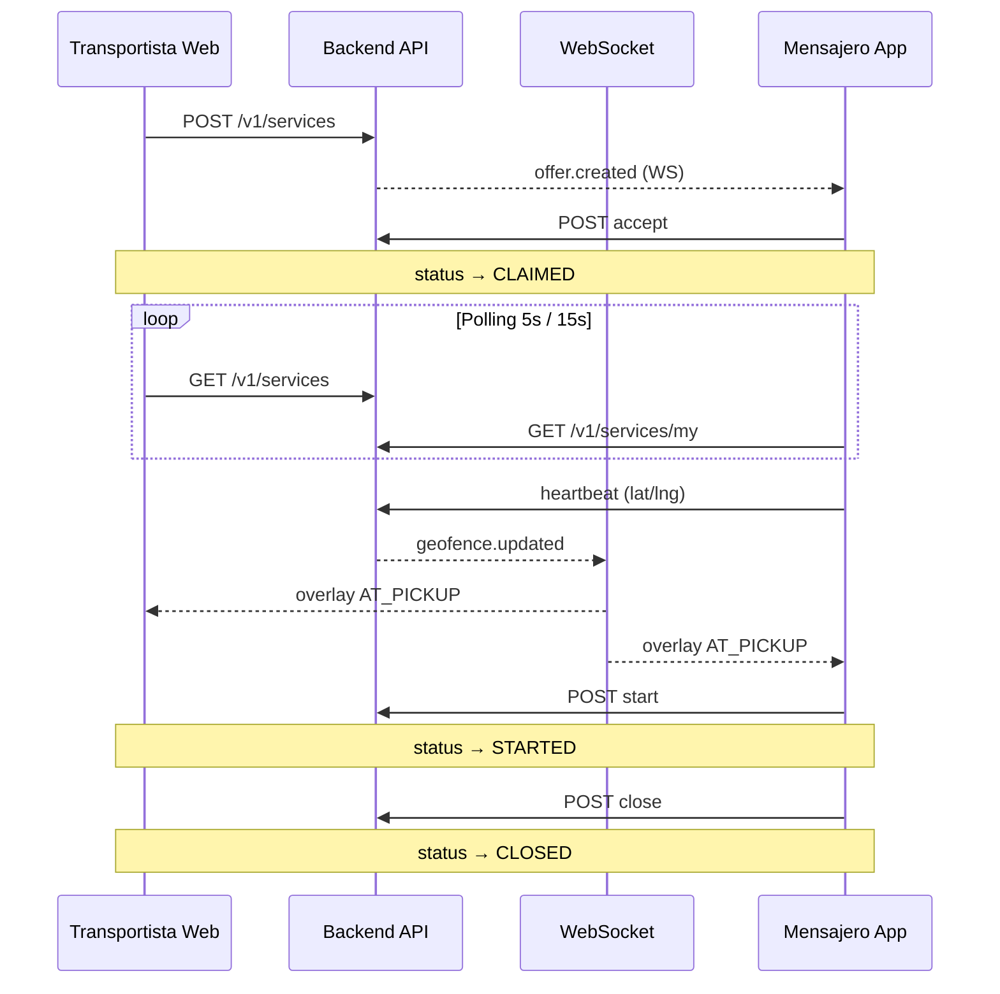

# Interfaz operacional — Rutafy Web

Documentación de la **interfaz de campo**: transportista y mensajero. El admin se documenta en [admin-panel.md](./admin-panel.md).

Rutafy es una app **operativa tipo ride-hailing/logística ligera**: el usuario reacciona a un servicio activo, no explora tablas ni informes complejos.

---

## Audiencias y rutas

| Ruta | Panel | Rol | Auth |
|------|-------|-----|------|
| `/` | `RoleSelector` | Selector rol | — |
| `/login` | `Login` | Transportista / mensajero | `http` + `authStorage` |
| `/register-transportista` | `RegisterTransportista` | Alta transportista | — |
| `/transportista` | `TransportistaPanel` | Solicitante / transportista | JWT app |
| `/mensajero` | `MensajeroPanel` | Mensajero en campo | JWT app |

Legacy (no foco operativo): `/client/*`, `/driver/*`.

---

## Stack operativo

| Capa | Tecnología |
|------|------------|
| UI | React 18 + TypeScript + Vite |
| HTTP | `api/http.ts` → `VITE_RUTAFY_API_BASE` |
| Realtime | WebSocket `/realtime?token=` |
| Mapas | `MapView`, `MessengerRouteMap` |
| Copy | `lib/resolveOperationalCopy.ts` |
| Distancia GPS | `lib/resolveOperationalDistance.ts` |
| Geofence overlay | hooks realtime |

Principios mobile-first: [mobile-ux-principles.md](./mobile-ux-principles.md).

---

## Modelo de datos operativo (frontend)

### Fuente de verdad del estado

```
status (REST polling)  +  geofenceState (WebSocket overlay)
```

Flujo oficial V1:

```
REQUESTED → OFFERED → CLAIMED → STARTED → CLOSED
```

| Status | UX transportista | UX mensajero |
|--------|-------------------|--------------|
| REQUESTED / OFFERED | Buscando mensajero | Oferta / disponible |
| CLAIMED | Mensajero asignado, va a recogida | ASSIGNED — ir a recogida |
| STARTED | Servicio en curso, va a entrega | IN_SERVICE — entregar |
| CLOSED | Completado | Sale del flujo activo |

**Regla crítica:** la UI hero usa **`status`**, no `dispatch_status`.

### Modelo híbrido REST + WebSocket

| Mecanismo | Transportista | Mensajero |
|-----------|---------------|-----------|
| Polling | **5 s** — `GET /v1/services` | **15 s** — `/v1/services/my` + ofertas |
| WebSocket | `geofence.updated` | `offer.created`, `service.cancelled`, `geofence.updated` |

Regla de oro: **nunca depender solo del WS** para saber si el servicio pasó a `STARTED` o `CLOSED`.

Detalle: [realtime-ui.md](./realtime-ui.md).

---

## Transportista (`TransportistaPanel`)

Archivo monolítico principal: `pages/TransportistaPanel.tsx` (~3700 líneas).

### Responsabilidades

1. **Solicitar servicio** — formulario compartido (inmediato / programado)
2. **Seguir servicio activo** — hero por fase operacional
3. **Historial / actividad** — listado de servicios
4. **Cuenta** — perfil, logout

### Hook de fase

`hooks/useTransportistaOperationalState.ts`:

- Entrada: lista de servicios + servicio activo elegido
- Salida: `operationalPhase` → `IDLE` | `SEARCHING` | `ASSIGNED` | `IN_PROGRESS` | `COMPLETED` | `CANCELLED`
- Prioridad al elegir activo: `STARTED` > `CLAIMED` > `REQUESTED` …

### Realtime

`hooks/useTransportistaRealtime.ts`:

- WS URL: `lib/messengerRealtimeWs.ts`
- Solo consume `geofence.updated`
- Mapa local: `geofenceByServiceId[service_id]`
- Overlay: `AT_PICKUP` (CLAIMED) | `AT_DROPOFF` (STARTED)

### Datos REST

| Request | Uso |
|---------|-----|
| `GET /v1/services?requester_company_id=&limit=100` | Listado + activo |
| `POST /v1/services` | Crear servicio |
| `POST /v1/services/:id/cancel` | Cancelar |
| `GET /v1/services/:id/evidences` | Evidencias en detalle |
| `GET /v1/nodes` | Nodos para origen |

Normalización: `normalizeBackendServiceToLocal()` — incluye `assigned_messenger`, `messengerLocation`, coords origen/destino.

### Vistas hero por fase

| Fase | Componente | Acción principal |
|------|------------|------------------|
| SEARCHING | `SearchingServiceView` | Esperar / cancelar |
| ASSIGNED | `AssignedServiceView` | Pasivo + cancelar |
| IN_PROGRESS | `InProgressServiceView` | Pasivo |
| COMPLETED | `CompletedServiceView` | Nueva solicitud |
| CANCELLED | `CancelledServiceView` | Reintentar |

### Tracking visible al transportista (CLAIMED / STARTED)

Componentes en hero:

| Componente | Datos requeridos |
|------------|------------------|
| `OperationalParticipantCard` | `assigned_messenger` (nombre, placa) |
| `TransportistaOperationalTrackingLine` | GPS mensajero + coords ruta + `location_updated_at` |
| `GpsFreshnessIndicator` | `location_updated_at` |
| `OperationalProximityMeter` | Haversine mensajero → origen/destino |

Cálculo distancia: **frontend** (`resolveTransportistaTrackingLine`, haversine).

Condiciones para mostrar distancia:

- GPS fresh (< 30 s)
- Coords mensajero + origen/destino válidos
- Status CLAIMED o STARTED
- No geofence AT_PICKUP / AT_DROPOFF

### ETA en hero

- **Estático:** `estimated_route_duration_minutes` vía `resolveOperationalCopy`
- **No** countdown con `eta_pickup_at` / `Date.now()` (eliminado a propósito)
- Geofence sustituye línea ETA: "Recogiendo documentos" / "Finalizando servicio"

### Mapa transportista

**No hay mini-mapa en hero** (solo texto de direcciones). Ver [maps-and-tracking.md](./maps-and-tracking.md).

---

## Mensajero (`MensajeroPanel`)

Archivo: `pages/MensajeroPanel.tsx`  
Hook central: `hooks/useMessengerOperationalState.ts` (~1900 líneas).

### uiState

| uiState | Condición | Vista |
|---------|-----------|-------|
| OFFLINE | No disponible | `OfflineView` |
| AVAILABLE | Online, sin oferta/servicio | `AvailableView` |
| OFFER | Primera oferta en cola | `OfferView` |
| ASSIGNED | Servicio `CLAIMED` | `AssignedView` |
| IN_SERVICE | Servicio `STARTED` | `InServiceView` |

### GPS y heartbeat

| Request | Uso |
|---------|-----|
| `PATCH /v1/messengers/:id/location` | Ubicación puntual |
| `POST /v1/mensajero/heartbeat` | Heartbeat periódico + GPS |
| `GET /v1/services/my?actor_role=mensajero` | Mis servicios |
| `GET /v1/messengers/:id/offers/active` | Ofertas |

Freshness GPS: TTL interno → `locationStatus`: fresh | stale | unknown.

### Mapa mensajero

`components/MessengerRouteMap.tsx`:

| Pin | Label | Color |
|-----|-------|-------|
| Mensajero | T | Azul `#2563eb` (solo GPS fresh) |
| Recogida | R | Verde `#16a34a` |
| Entrega | E | Morado `#7c3aed` |
| Polyline | R → E | Gris `#64748b` |

Altura típica: `h-48`. Navegación externa: `RouteNavigationLinks` (Google Maps / Waze).

### Acciones principales

| Fase | CTA |
|------|-----|
| OFFLINE | Ponerse en línea |
| OFFER | Aceptar oferta |
| ASSIGNED | Iniciar servicio |
| IN_SERVICE | Finalizar (PIN 4 dígitos) + evidencia opcional |

### WebSocket (en el mismo hook)

Eventos: `offer.created`, `service.cancelled`, `geofence.updated`.

**No** abrir segundo socket en el panel.

---

## Copy operacional centralizado

`lib/resolveOperationalCopy.ts`:

Entrada: `serviceStatus`, `geofenceState`, `estimatedRouteDurationMinutes`, `audience`.

Salida: `title`, `subtitle`, `etaLabel`.

Prioridad: **geofence > status**.

Audiencias: `transportista` | `mensajero` — mismo motor, copy distinto.

Estados detallados: [ui-operational-states.md](./ui-operational-states.md).

---

## Utilidades compartidas operativas

| Módulo | Uso |
|--------|-----|
| `lib/formatOperationalLocation.ts` | Texto "Recoger en" / "Entregar en", coords |
| `lib/resolveOperationalDistance.ts` | Haversine, tracking line, proximidad |
| `lib/resolveGpsFreshness.ts` | fresh / aging / stale, "hace X s" |
| `lib/resolveOperationalProximity.ts` | Barra progreso proximidad |
| `lib/resolveOperationalTimeline.ts` | Timeline pasos servicio |
| `components/OperationalParticipantCard.tsx` | Tarjeta mensajero/transportista |
| `components/OperationalTimeline.tsx` | Línea temporal |
| `components/OperationalTrackingLine.tsx` | Línea con tick 1 s |
| `components/OperationalProximityMeter.tsx` | Medidor distancia |

---

## API cliente campo (`api/services.ts`)

| Función | Endpoint |
|---------|----------|
| `createService` | POST `/v1/services` |
| `startService` / `closeService` | POST start/close |
| `cancelServiceByTransportista` | POST cancel |
| `getActiveOffersByMessenger` | GET offers active |
| `acceptServiceOffer` | POST accept |
| `patchMessengerLocation` | PATCH location |
| `postMessengerHeartbeat` | POST heartbeat |

Auth: `http.ts` con refresh en `/v1/auth/refresh`.

---

## Diagrama flujo operativo end-to-end



---

## Separación operativo vs admin vs trazabilidad

| Concepto | Operativo campo | Admin ops map | Admin trazabilidad |
|----------|-----------------|---------------|-------------------|
| Tiempo | Presente | Presente (~30 s) | Pasado (sesión) |
| GPS mensajero | Heartbeat → tracking line | Pin en mapa ops | — |
| Captura Android | — | — | Polyline I/F |
| Servicio | status CLAIMED/STARTED | Pins + polyline R→E | — |
| ETA hero | Estático dispatch | SLA deadlines | — |
| Usuario | Transportista, mensajero | Operador admin | Analista admin |

---

## Regresiones a evitar

Documentadas en detalle en docs hermanas; resumen:

1. Usar `dispatch_status` en heroes de campo
2. Countdown ETA con `eta_pickup_at` y `Date.now()`
3. Depender solo de WebSocket para status
4. Pin mensajero en mapa con GPS stale
5. Refrescar listado completo en cada `geofence.updated`
6. Mezclar copy/UI de trazabilidad admin en paneles de campo
7. Segunda conexión WebSocket por panel

---

## Extender la interfaz operativa

| Cambio | Archivos |
|--------|----------|
| Nuevo copy hero | `resolveOperationalCopy.ts` + vista hero |
| Nueva fase UI | hook uiState + vista fullscreen |
| Nuevo evento WS | handler en hook realtime existente |
| Tracking transportista | `TransportistaPanel` normalización + `resolveOperationalDistance` |
| Mapa transportista | nuevo componente; **no** reutilizar ops map |

---

## Mapa de documentación relacionada

| Documento | Contenido |
|-----------|-----------|
| [frontend-architecture.md](./frontend-architecture.md) | Stack, hooks, polling |
| [ui-operational-states.md](./ui-operational-states.md) | Estados y componentes por fase |
| [realtime-ui.md](./realtime-ui.md) | WS, geofence, reconnect |
| [maps-and-tracking.md](./maps-and-tracking.md) | MessengerRouteMap, GPS, ETA |
| [mobile-ux-principles.md](./mobile-ux-principles.md) | Mobile-first, jerarquía |
| [admin-panel.md](./admin-panel.md) | Panel admin, ops map, trazabilidad |

---

## Archivos de referencia rápida

```
client/src/
├── pages/
│   ├── TransportistaPanel.tsx
│   └── MensajeroPanel.tsx
├── hooks/
│   ├── useMessengerOperationalState.ts
│   ├── useTransportistaOperationalState.ts
│   └── useTransportistaRealtime.ts
├── lib/
│   ├── resolveOperationalCopy.ts
│   ├── resolveOperationalDistance.ts
│   ├── resolveGpsFreshness.ts
│   ├── formatOperationalLocation.ts
│   └── messengerRealtimeWs.ts
├── components/
│   ├── MessengerRouteMap.tsx
│   ├── RouteNavigationLinks.tsx
│   ├── OperationalParticipantCard.tsx
│   └── OperationalProximityMeter.tsx
└── api/
    ├── http.ts
    └── services.ts
```
