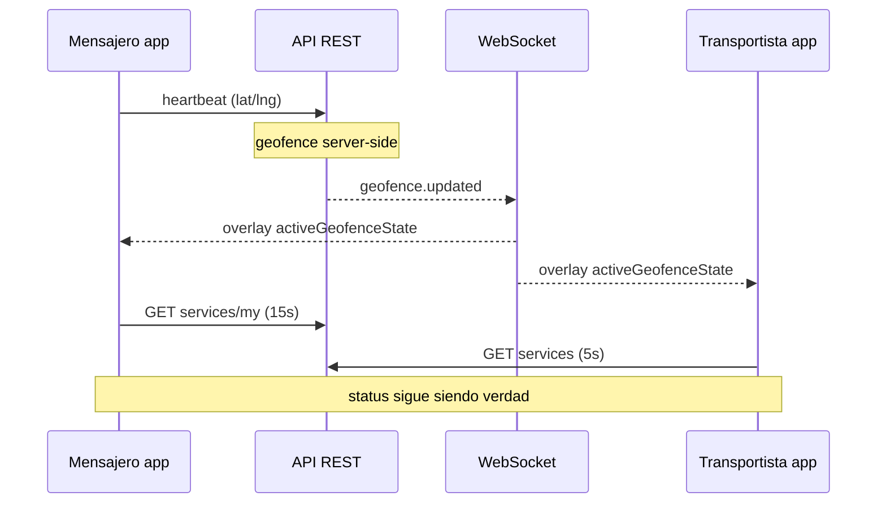

# Realtime en UI

Cómo el frontend combina **polling REST** y **WebSocket** sin contradecir el estado del servicio.

## Principio

| Capa | Rol |
|------|-----|
| **Polling** | Fuente de verdad del `status` y datos del servicio |
| **WebSocket** | Acelerador UX (geofence, ofertas); overlay local |
| **Acciones POST** | Transiciones inmediatas (accept, start, close) + refresh |

**No depender solo del WS:** si el socket cae, el operador debe seguir viendo el estado correcto en ≤15 s (mensajero) o ≤5 s (transportista).

## URL y auth

- Helper: `client/src/lib/messengerRealtimeWs.ts` → `buildRutafyRealtimeWebSocketUrl(token)`.
- Misma ruta para mensajero y transportista: `wss://…/realtime?token=<JWT access>`.
- El servidor asocia conexión a `user_id` del token (`sub`).

## Eventos consumidos hoy

| Evento | Mensajero | Transportista | Efecto UI |
|--------|-----------|---------------|-----------|
| `offer.created` | Sí | No | Debounce 200 ms → refresh ofertas |
| `service.cancelled` | Sí | No | Quita oferta/servicio de listas locales |
| `geofence.updated` | Sí | Sí (`useTransportistaRealtime`) | Actualiza `geofenceByServiceId` |

Otros eventos (`service.started`, etc.) **no** se usan en frontend operativo; el polling trae el nuevo `status`.

## Flujo geofence (end-to-end, solo perspectiva UI)

Payload relevante en cliente (`data`):

- `service_id`, `service_status`, `state` (`AT_PICKUP`, `AT_DROPOFF`, `NEAR_*`, …)
- `messenger_id` (mensajero filtra por `actorId`; transportista filtra por servicio activo)

## Reglas de overlay geofence (frontend)

Implementadas en hooks (misma lógica conceptual):

| `state` (WS) | Se guarda en mapa | Condición |
|--------------|-------------------|-----------|
| `AT_PICKUP` | `AT_PICKUP` | `service_status === CLAIMED` |
| `AT_DROPOFF` | `AT_DROPOFF` | `service_status === STARTED` |
| `NEAR_*` u otro | Borrar entrada | — |

Derivación UI: `activeGeofenceState = map[activeServiceId] ?? null`.

**No** se llama `refreshMyServices` / `loadTransportistaHistory` por cada geofence (evita parpadeo y carga extra).

## Polling (intervalos actuales)

| Panel | Intervalo | Qué refresca |
|-------|-----------|--------------|
| Transportista | **5 s** | `GET /v1/services` → `myServices`, `activeService` |
| Mensajero online | **15 s** | `refreshMyServices` + `refreshAvailableServices` |

El overlay geofence puede cambiar en **sub-segundo**; el `status` puede tardar hasta el siguiente poll.

## Reconnect y token

| Evento | Comportamiento |
|--------|----------------|
| `auth:token-refreshed` | Reconectar WS (incrementa versión interna) |
| `auth:logout` | Cerrar socket + vaciar mapa geofence |
| Unmount / `enabled=false` | Cerrar socket + limpiar mapa |
| Mensajero offline | Cierra WS en hook mensajero |

Transportista: `useTransportistaRealtime({ enabled: user transportista logueado, token, activeServiceId })`.

## Limpieza de estado geofence

| Trigger | Acción |
|---------|--------|
| `activeServiceId === null` | Vaciar mapa (transportista) |
| `NEAR_*` / estado no AT | `delete map[service_id]` |
| Cancel / close exitoso (mensajero) | Borrar entrada del servicio |
| Logout | Mapa vacío |

Al cambiar de servicio activo, el mapa puede conservar otras entradas; solo se **muestra** la del `service_id` activo.

## Mensajero: dónde vive el socket

- Archivo: `useMessengerOperationalState.ts` (un solo `useEffect` WS).
- No abrir segundo socket en `MensajeroPanel`.

## Transportista: dónde vive el socket

- Archivo: `useTransportistaRealtime.ts` (solo `geofence.updated`).
- `TransportistaPanel` pasa `activeGeofenceState` a `AssignedServiceView` / `InProgressServiceView`.

## Por qué no WS-only

1. Reconexiones móviles pierden eventos.
2. Pestaña en background puede suspender WS.
3. El backend no reenvía historial de geofence al conectar.
4. `status` legal (CLOSED, CANCELLED) debe venir de REST fiable.

## Regresiones a evitar

- Refrescar listado completo en cada `geofence.updated`.
- Mostrar geofence de otro `service_id` en el hero (filtrar por activo).
- Segunda conexión WS por panel.
- Usar geofence sin pasar por `resolveOperationalCopy` (duplicar strings).

## Debug rápido

1. Network → WS `/realtime` → frames `geofence.updated`.
2. Confirmar `service_status` en payload vs `activeService.status`.
3. Si UI no cambia: revisar `activeGeofenceState` y prioridad geofence en copy.
4. Si `status` desincronizado: revisar polling, no el WS.
